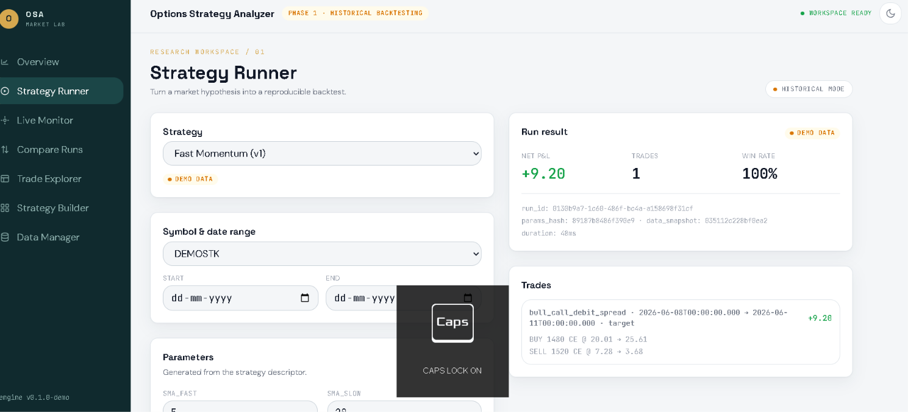
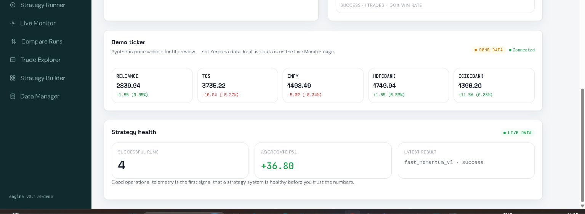
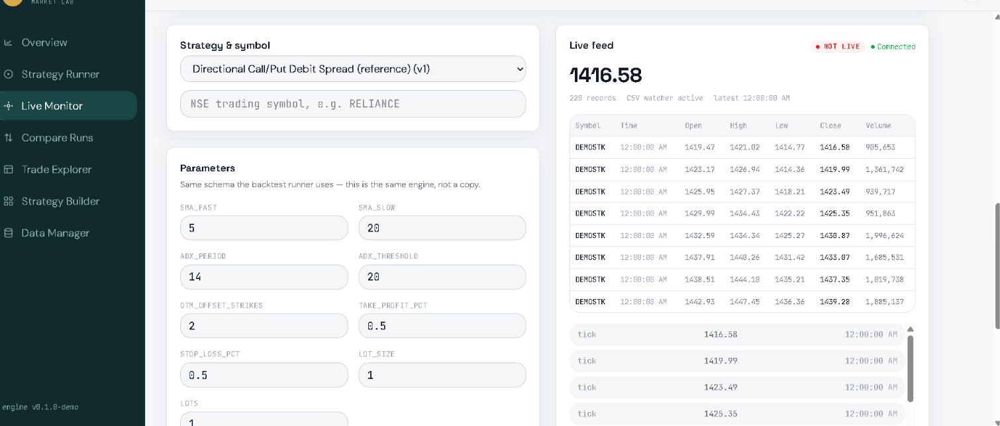
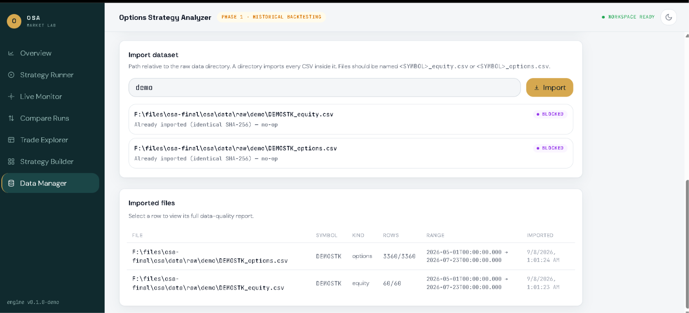
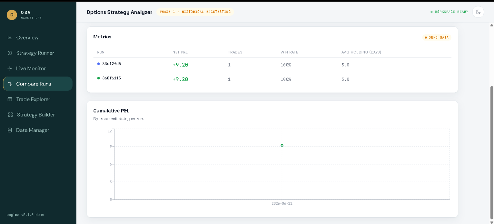
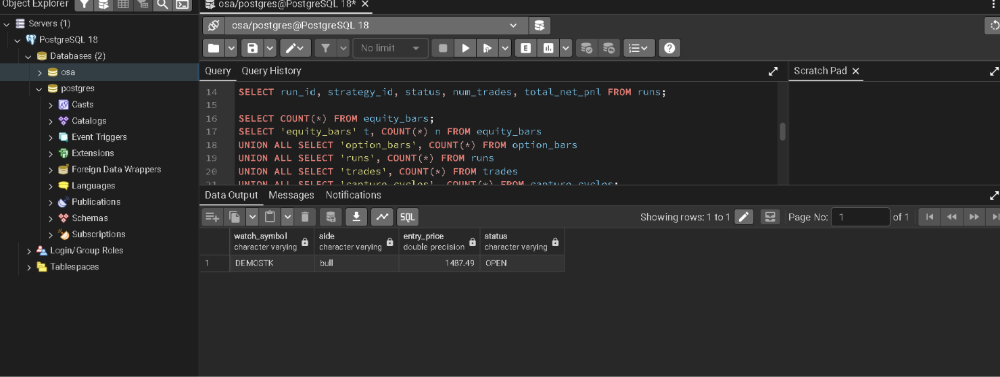
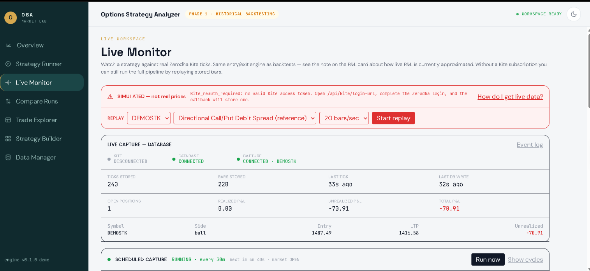

# Options Strategy Analyzer

A full-stack Options Strategy Analyzer for importing market data,
running options strategies, executing backtests, persisting trades,
and analyzing strategy performance.

> ⚠️ **Important:** The current build uses synthetic demo data.
> Strategy formulas, indicators, lot sizes, transaction costs, and
> real NSE data still require validation before using P&L numbers
> for real trading decisions.

---

## 📸 Application Screenshots

### Dashboard

  

---

### Data Manager

  

---

### Strategy Runner

  

---

### Trade Explorer

  

---

### Strategy Analysis

  

---

### Dashboard Overview

  

---

### Smart Analysis

  

---
